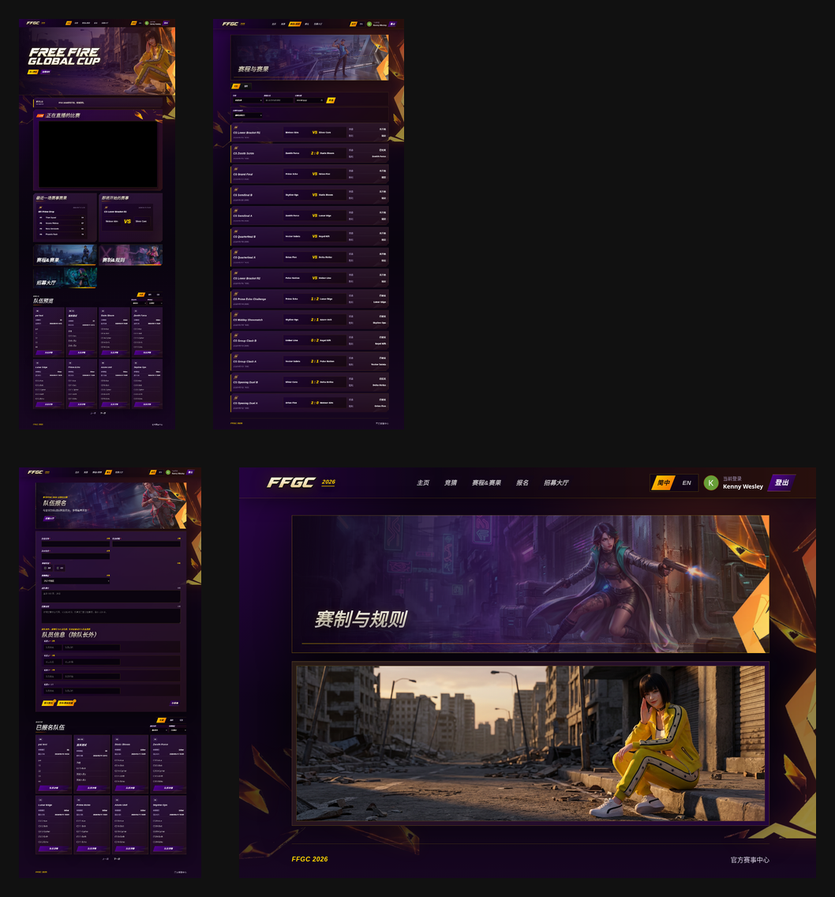
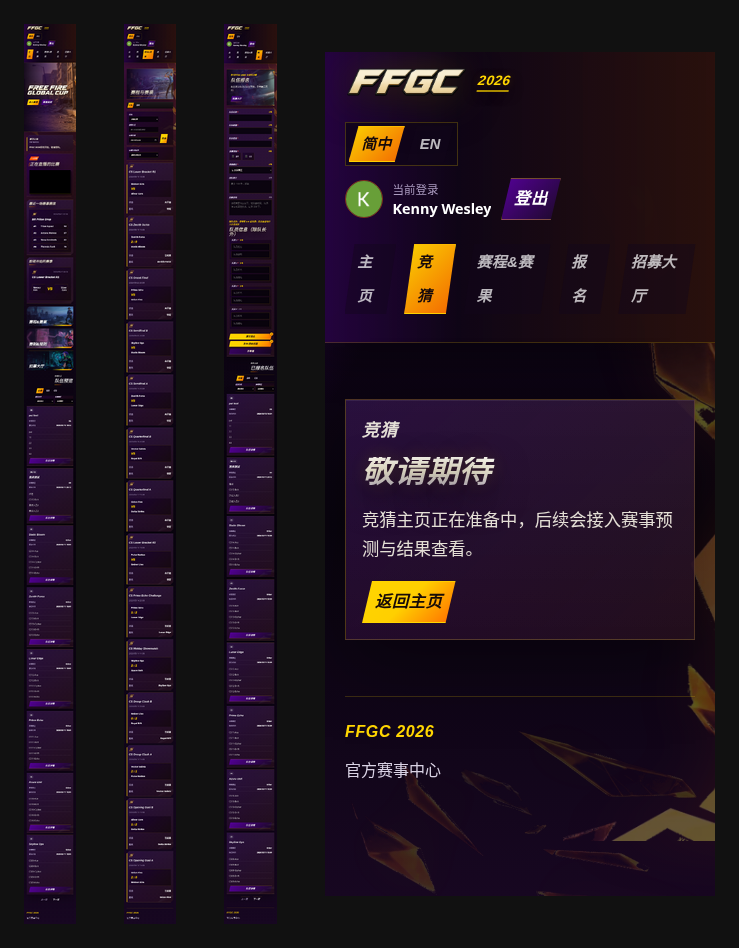

# FFGC 官网 UE / UI 体验评估报告

测试站点：https://ffgcofficial.run.ingarena.net/

测试时间：2026-05-15 GMT+8  
测试范围：登录后 7 个页面：首页、赛程&赛果、赛制&规则、报名、招募大厅、竞猜、账号；同时覆盖桌面端与移动端。

> 本报告重点看用户体验、视觉观感、信息层级、内部赛事网站可用性，不展开低优先级技术小 bug。

---

## 1. 总体结论

当前版本已经具备完整赛事官网雏形：有登录、首页、直播、赛程、队伍、报名、招募、竞猜占位和账号页，整体深色电竞风统一，视觉上能建立 FFGC 的赛事氛围。

但从用户体验看，它现在更像“内容都放上去了的展示页”，还没有完全变成“用户能快速完成任务的赛事工具”。主要问题集中在：

1. 首页主任务不够聚焦，用户第一眼不确定该优先做什么。
2. 移动端信息密度过高，查赛程 / 报名 / 看队伍会累。
3. 报名页表单压力偏大，缺少步骤感和进度感。
4. 赛程页筛选存在感过强，比赛列表本身还可以更好读。
5. 竞猜、规则、账号等弱功能页面显得单薄，像“占位页”。

如果这是内部比赛网站，不需要按外部商业官网标准打磨到极致；但建议优先优化“移动端可读性、首页任务聚焦、报名流程、空状态引导”这四件事，性价比最高。

---

## 2. 做得好的地方

### 2.1 电竞氛围明确

- 深色背景 + 金色高亮 + 赛事 Logo，整体符合 Free Fire / 电竞赛事调性。
- Hero、卡片、按钮、标签的视觉语言基本统一。
- 页面不像临时后台，而是有“赛事官网”的外观基础。

### 2.2 功能框架完整

已覆盖内部赛事常见场景：

- 看赛事公告
- 看直播
- 看最近赛果
- 看即将开始赛事
- 查赛程
- 报名
- 招募队友
- 查看账号状态
- 竞猜功能预留

对内部比赛来说，功能模块方向是对的。

### 2.3 桌面端基础体验可用

桌面端页面宽度、卡片排列、导航位置基本合理。赛程页和报名页虽然信息较多，但桌面端仍可完成任务。

---

## 3. 优先级最高的体验问题

## P0-UE-01：首页首屏主任务不够明确

**页面**：首页  
**影响对象**：所有用户

### 现象

首页顶部有赛事视觉、公告、直播、最近赛果、即将赛事、快捷入口、队伍预览等模块，但用户第一眼不够明确：

- 选手应该先报名？
- 观众应该先看赛程？
- 当前最重要的赛事状态是什么？
- 现在有没有直播？下一场什么时候？

直播模块视觉面积很大，但如果没有实际直播内容，会变成一个很重的黑色视频框，反而抢走注意力。

### 建议

根据赛事阶段动态突出一个主 CTA：

- 报名期：主按钮 =「立即报名」；副按钮 =「查看规则」
- 比赛期：主按钮 =「查看今日赛程」；副按钮 =「进入直播」
- 赛后：主按钮 =「查看赛果」；副按钮 =「查看队伍排名」

直播未开播时不要只放黑屏，建议显示：

```text
当前暂无直播
下一场：CS Lower Bracket R1 · 05/15 18:30
按钮：查看赛程
```

---

## P0-UE-02：移动端信息密度过高，阅读压力大

**页面**：首页、赛程、报名  
**影响对象**：手机用户

### 现象

移动端截图显示页面纵向很长，卡片信息密集，用户需要大量滚动。尤其是：

- 首页队伍卡片字段较多。
- 赛程列表比赛多，信息重复度高。
- 报名表单字段多，连续填写压力大。
- 顶部导航在手机上仍然承担较多信息。

内部赛事网站的真实使用场景很可能是手机上临时查赛程、看报名、找队伍。如果手机端阅读成本高，会明显影响体验。

### 建议

移动端优先做“减负”：

1. 顶部导航改成汉堡菜单，保留 Logo + 当前账号 + 菜单按钮。
2. 队伍卡片默认只显示：队名、赛区、项目、人数 / 状态。
3. 赛程卡片突出时间、双方、比分 / 状态，弱化重复标签。
4. 报名页改成分步表单，避免一屏连续十几个输入项。

---

## P0-UE-03：报名流程像后台表单，不像参赛报名向导

**页面**：报名页  
**影响对象**：参赛队长

### 现象

报名页把队伍信息、队长信息、项目、赛区、简介、招募说明、队员信息、提交、招募、草稿和报名记录都放在同一长页面里。

用户能填，但心理负担比较重，尤其移动端更明显。

### 建议

改成 4 步：

1. 选择参赛项目和赛区
2. 填队伍基础信息
3. 添加队员
4. 确认并提交

体验细节：

- 顶部显示进度：`1/4 基础信息`
- 队员信息用折叠卡片
- 底部固定主按钮：`下一步 / 提交报名`
- 「发布招募」作为单独路径，不要和正式报名按钮并列抢注意力

---

## 4. 中高优先级体验问题

## P1-UE-01：赛程页需要更强的“按日期看比赛”能力

**页面**：赛程&赛果

### 现象

赛程页内容完整，但列表是连续卡片，用户需要自己扫日期。筛选区比较完整，但视觉占比偏大。

### 建议

- 默认按日期分组，例如：
  - 今日 05/15
  - 明日 05/16
  - 已结束
- 增加快捷筛选：`今日比赛 / 未开始 / 已结束`
- 筛选区可折叠，减少对列表的压迫。
- 比赛卡片中“未开始 / 已结束 / 胜利方”状态可以更醒目。

---

## P1-UE-02：队伍预览信息过多，首页被拉长

**页面**：首页

### 现象

首页队伍预览展示了很多队伍和成员名单。作为首页模块，它承担的信息太多，导致页面变长。

### 建议

首页只展示摘要：

- 总报名队伍数
- BR / CS 队伍数
- 最新 3-4 支队伍
- 按钮：`查看全部队伍`

成员名单可以进入详情页后再看。

---

## P1-UE-03：竞猜入口状态需要更友好

**页面**：竞猜

### 现象

竞猜页显示“敬请期待”，状态明确，但页面内容太少。用户点击入口后只知道功能没开，不知道什么时候开、可以先做什么。

### 建议

导航上加小角标：`即将上线`。

竞猜页增加：

```text
竞猜将在比赛阶段开放
开放后可预测胜负、查看结果
你可以先查看赛程和参赛队伍
```

并放两个按钮：

- 查看赛程
- 查看队伍

---

## P1-UE-04：规则页视觉有氛围，但实用性不足

**页面**：规则页

### 现象

规则页视觉上像海报页，但从用户查规则角度，缺少结构化内容。用户想快速知道报名规则、赛制、积分、晋级、违规处理时，不够方便。

### 建议

用“海报 + 文字规则”组合：

- 顶部保留视觉图
- 下方增加规则目录
- 关键规则做信息块 / 表格

推荐结构：

1. 参赛资格
2. 报名时间
3. 比赛模式
4. 赛程安排
5. 积分 / 晋级规则
6. 违规处理
7. FAQ

---

## 5. 视觉与 UI 细节建议

### 5.1 金色使用略多

金色同时用于按钮、标签、边框、装饰、比分和高亮，容易造成所有内容都“很重要”。

建议：

- 金色只用于主 CTA 和关键状态。
- 普通标签用灰紫 / 深色描边即可。
- 降低非核心装饰线的亮度。

### 5.2 卡片层级可以更轻

目前很多模块都是重卡片 + 边框 + 背景图 + 发光效果。视觉氛围强，但信息阅读时有疲劳感。

建议：

- 首页核心模块保留重视觉。
- 列表型页面（赛程、队伍、报名记录）减少装饰，提升阅读效率。

### 5.3 小字对比度需要照顾移动端

深色背景上的灰色小字在桌面端可接受，但手机上会偏吃力。

建议：

- 移动端小字至少 13-14px。
- 次级文字颜色提高一点亮度。
- 关键时间、状态、按钮文案不要太小。

### 5.4 账号页过于单薄

账号页目前只有头像 / 姓名 / 邮箱 / 返回 / 登出。作为内部网站可以接受，但视觉上像临时页。

建议增加：

- 我的队伍
- 我的报名状态
- 我的招募状态
- 最近访问入口

---

## 6. 页面级建议

| 页面 | 当前体验 | 建议 |
|---|---|---|
| 首页 | 氛围强，但任务不聚焦 | 按赛事阶段突出主 CTA，直播无内容时显示状态提示 |
| 赛程&赛果 | 内容完整，但列表扫描成本高 | 按日期分组，突出今日比赛和状态 |
| 规则 | 视觉像海报，实用性弱 | 增加结构化规则文本和目录 |
| 报名 | 功能完整，但表单压力大 | 改成分步报名向导 |
| 招募大厅 | 简洁可用，但信息偏少 | 增加“我想加入 / 联系队长”行为引导 |
| 竞猜 | 状态明确但空 | 增加开放时间说明和跳转按钮 |
| 账号 | 基础可用但临时感强 | 增加我的队伍 / 报名状态入口 |

---

## 7. 推荐改造优先级

### 第一优先级：低成本、高收益

1. 首页 Hero 按阶段改主 CTA。
2. 直播无内容时加“暂无直播 / 下一场比赛”占位。
3. 竞猜导航加“即将上线”角标。
4. 首页队伍预览减少默认展示数量。
5. 移动端提升小字字号和对比度。

### 第二优先级：中等改造

6. 赛程页按日期分组。
7. 报名页拆成 3-4 步向导。
8. 规则页增加结构化规则文本。
9. 账号页增加“我的队伍 / 我的报名”。

### 第三优先级：视觉精修

10. 减少金色高亮泛用。
11. 统一卡片间距和轻重层级。
12. 优化移动端导航为折叠菜单。

---

## 8. 一句话总结

FFGC 官网现在“赛事氛围”和“功能框架”已经有了，下一步最值得优化的不是技术小 bug，而是让用户更快完成三件事：**看懂当前赛事状态、快速找到赛程、顺畅完成报名**。

---

## 9. 截图证据

### 桌面端总览



### 移动端总览



### 单页截图

- 首页桌面端：`screenshots/desktop-home.png`
- 赛程桌面端：`screenshots/desktop-schedule.png`
- 报名桌面端：`screenshots/desktop-register.png`
- 规则桌面端：`screenshots/desktop-rules.png`
- 竞猜桌面端：`screenshots/desktop-guess.png`
- 首页移动端：`screenshots/mobile-home.png`
- 赛程移动端：`screenshots/mobile-schedule.png`
- 报名移动端：`screenshots/mobile-register.png`
- 竞猜移动端：`screenshots/mobile-guess.png`
